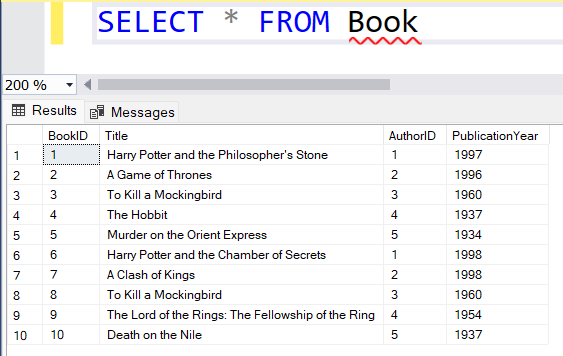

# Database Project Submission

## SQL queries for:

### 1. Creating Tables
```sql

CREATE TABLE Author
(
    AuthorID INT IDENTITY(1,1) PRIMARY KEY,
    FirstName VARCHAR(50) NOT NULL,
    LastName VARCHAR(50) NOT NULL
);

CREATE TABLE Book
(
    BookID INT IDENTITY(1,1) PRIMARY KEY,
    Title VARCHAR(100) NOT NULL,
    AuthorID INT NOT NULL FOREIGN KEY REFERENCES Author(AuthorID),
    PublicationYear INT
);

CREATE TABLE Patron
(
    PatronID INT IDENTITY(1,1) PRIMARY KEY,
    FirstName VARCHAR(50) NOT NULL,
    LastName VARCHAR(50) NOT NULL,
    MembershipDate DATE NOT NULL
);

CREATE TABLE BorrowingDetails
(
    BorrowID INT IDENTITY(1,1) PRIMARY KEY,
    BookID INT NOT NULL FOREIGN KEY REFERENCES Book(BookID),
    PatronID INT NOT NULL FOREIGN KEY REFERENCES Patron(PatronID),
    BorrowDate DATE NOT NULL,
    ReturnDate DATE
);

```

### 2. Inserting Data
#### Authors
```sql
INSERT INTO Author (FirstName, LastName)
VALUES ('J.K.', 'Rowling');

INSERT INTO Author (FirstName, LastName)
VALUES ('George R.R.', 'Martin');

INSERT INTO Author (FirstName, LastName)
VALUES ('Harper', 'Lee');

INSERT INTO Author (FirstName, LastName)
VALUES ('J.R.R.', 'Tolkien');

INSERT INTO Author (FirstName, LastName)
VALUES ('Agatha', 'Christie');
```
#### Books
```sql
INSERT INTO Book (Title, AuthorID, PublicationYear)
VALUES ('Harry Potter and the Philosopher''s Stone', 1, 1997);

INSERT INTO Book (Title, AuthorID, PublicationYear)
VALUES ('A Game of Thrones', 2, 1996);

INSERT INTO Book (Title, AuthorID, PublicationYear)
VALUES ('To Kill a Mockingbird', 3, 1960);

INSERT INTO Book (Title, AuthorID, PublicationYear)
VALUES ('The Hobbit', 4, 1937);

INSERT INTO Book (Title, AuthorID, PublicationYear)
VALUES ('Murder on the Orient Express', 5, 1934);

INSERT INTO Book (Title, AuthorID, PublicationYear)
VALUES ('Harry Potter and the Chamber of Secrets', 1, 1998);

INSERT INTO Book (Title, AuthorID, PublicationYear)
VALUES ('A Clash of Kings', 2, 1998);

INSERT INTO Book (Title, AuthorID, PublicationYear)
VALUES ('To Kill a Mockingbird', 3, 1960);

INSERT INTO Book (Title, AuthorID, PublicationYear)
VALUES ('The Lord of the Rings: The Fellowship of the Ring', 4, 1954);

INSERT INTO Book (Title, AuthorID, PublicationYear)
VALUES ('Death on the Nile', 5, 1937);
```
#### Patrons
```sql
INSERT INTO Patron (FirstName, LastName, MembershipDate)
VALUES ('John', 'Doe', '2024-01-25');

INSERT INTO Patron (FirstName, LastName, MembershipDate)
VALUES ('Jane', 'Smith', '2024-01-26');

INSERT INTO Patron (FirstName, LastName, MembershipDate)
VALUES ('Alice', 'Johnson', '2024-01-27');

INSERT INTO Patron (FirstName, LastName, MembershipDate)
VALUES ('Bob', 'Williams', '2024-01-28');

INSERT INTO Patron (FirstName, LastName, MembershipDate)
VALUES ('Eva', 'Jones', '2024-01-29');
```
#### Borrowing
```sql
INSERT INTO BorrowingDetails (BookID, PatronID, BorrowDate, ReturnDate)
VALUES (1, 1, '2024-01-25', '2024-02-25');

INSERT INTO BorrowingDetails (BookID, PatronID, BorrowDate, ReturnDate)
VALUES (2, 2, '2024-01-26', '2024-02-26');

INSERT INTO BorrowingDetails (BookID, PatronID, BorrowDate, ReturnDate)
VALUES (3, 3, '2024-01-26', '2024-02-16');

INSERT INTO BorrowingDetails (BookID, PatronID, BorrowDate, ReturnDate)
VALUES (4, 4, '2024-01-24', '2024-02-24');

INSERT INTO BorrowingDetails (BookID, PatronID, BorrowDate, ReturnDate)
VALUES (5, 5, '2024-01-23', '2024-02-23');
```

### 3. Updating Data
```sql
UPDATE Book
SET
    Title = 'The Great Gatsby',
    PublicationYear = 1925
WHERE
    BookID = 1;

UPDATE Book
SET
    Title = '1984',
    PublicationYear = 1949
WHERE
    BookID = 3;

---------------------------
    UPDATE Patron
SET
    MembershipDate = '2024-02-15'
WHERE
    PatronID = 3;
```

### 4. Search queries
#### 4.1. List all books along with their authors' names:
```sql
SELECT
    B.BookID,
    B.Title AS BookTitle,
    A.FirstName AS AuthorFirstName,
    A.LastName AS AuthorLastName
FROM
    Book AS B
    INNER JOIN Author AS A ON B.AuthorID = A.AuthorID;
```

#### 4.2. Find all books borrowed by a particular patron:
> PatronID of the specific patron (replace X with the actual PatronID).
```sql
SELECT
    BD.BorrowID,
    B.Title AS BookTitle,
    P.FirstName AS PatronFirstName,
    P.LastName AS PatronLastName,
    BD.BorrowDate,
    BD.ReturnDate
FROM
    BorrowingDetails AS BD
    INNER JOIN Book AS B ON BD.BookID = B.BookID
    INNER JOIN Patron AS P ON BD.PatronID = P.PatronID
WHERE
    BD.PatronID = X;
```

#### 4.3. List all patrons who have not returned books by the due date:
```sql
SELECT
    P.PatronID,
    P.FirstName,
    P.LastName,
    BD.BookID,
    B.Title AS BookTitle,
    BD.BorrowDate,
    BD.ReturnDate
FROM
    BorrowingDetails AS BD
    INNER JOIN Patron AS P ON BD.PatronID = P.PatronID
    INNER JOIN Book AS B ON BD.BookID = B.BookID
WHERE
    BD.ReturnDate IS NULL
    AND GETDATE() > BD.BorrowDate; -- Assuming the due date has passed
```

## ER Diagram


## Table contents
### Inserted data
#### Authors

#### Books

#### Patrons

#### Borrowing details


### Updated data
#### 1. Updated books
> Changed books name and title for BookID = 1 and BookID = 3


#### 2. Updated membership for patron
> Changed PatronID = 3 membership to '2024-02-15'


## Data from requested search queries
### First
>A query to list all books along with their authors' names.


### Second
>A query to find all books borrowed by a particular patron.


### Third
>A query to list all patrons who have not returned books by the due date.


