# Multi-Table Queries. WEEK 5 Assignment

## Required tables

#### Student table
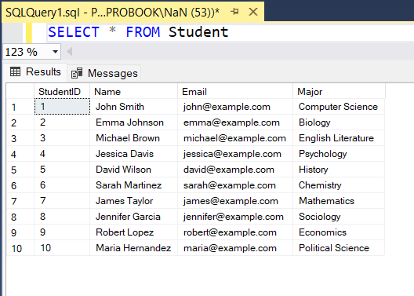

#### Course table
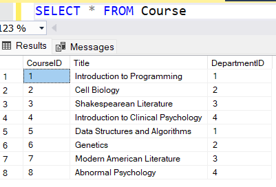

#### Instructor table
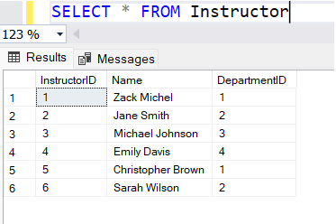

#### Department table
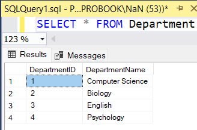

#### Enrollment table
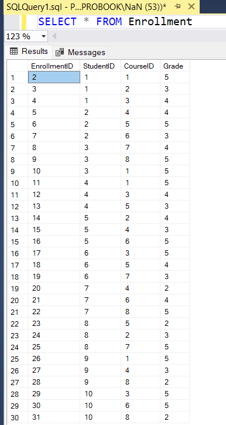

## Insert data

#### Student insert
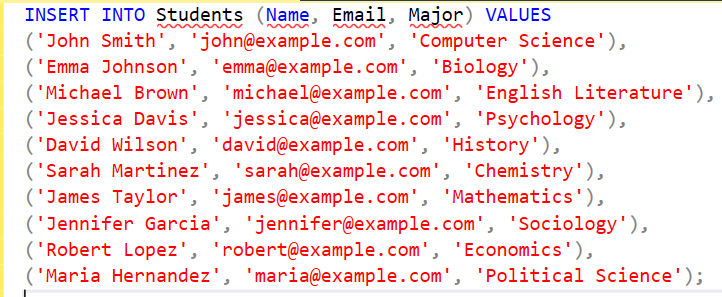

#### Course insert
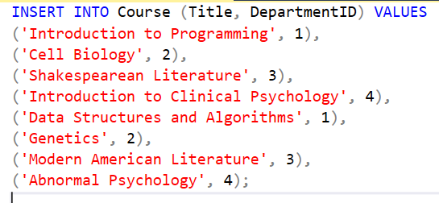

#### Instructor insert
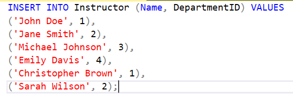

#### Department insert
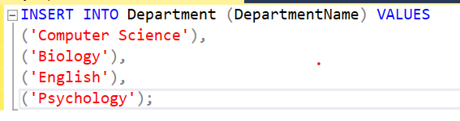

## Query Excercises

#### 1. Find all students enrolled in a specific course
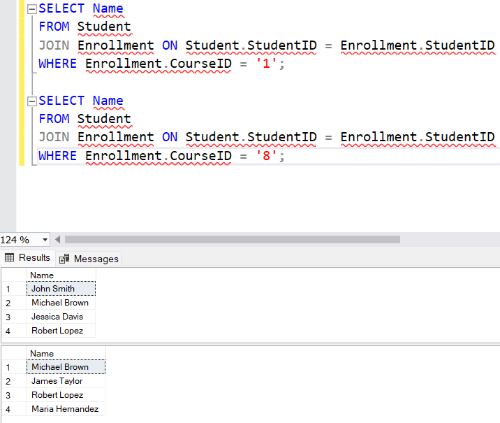

#### 2. List all courses offered by specific department
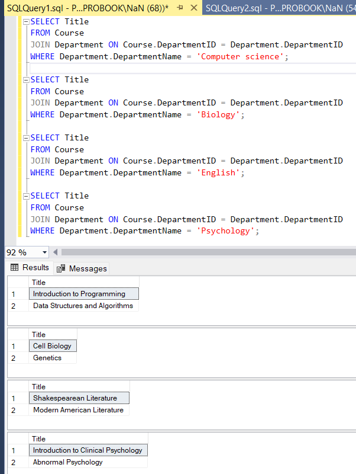

#### 3. Find the average of students in each course
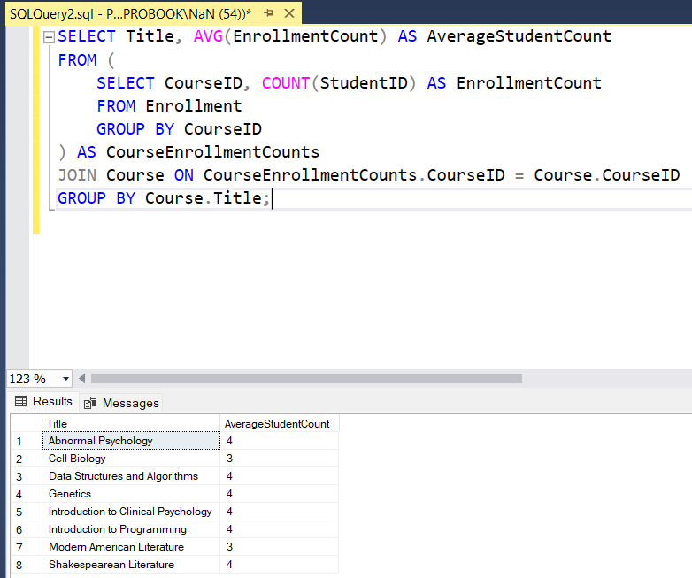

#### 4. List all instructors who teach a student with a specific ID
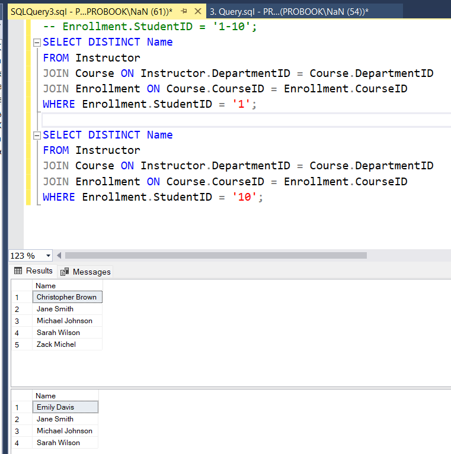

#### 5. Update grades for students in particular course
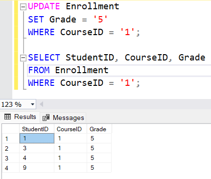

## Database ER Diagram
